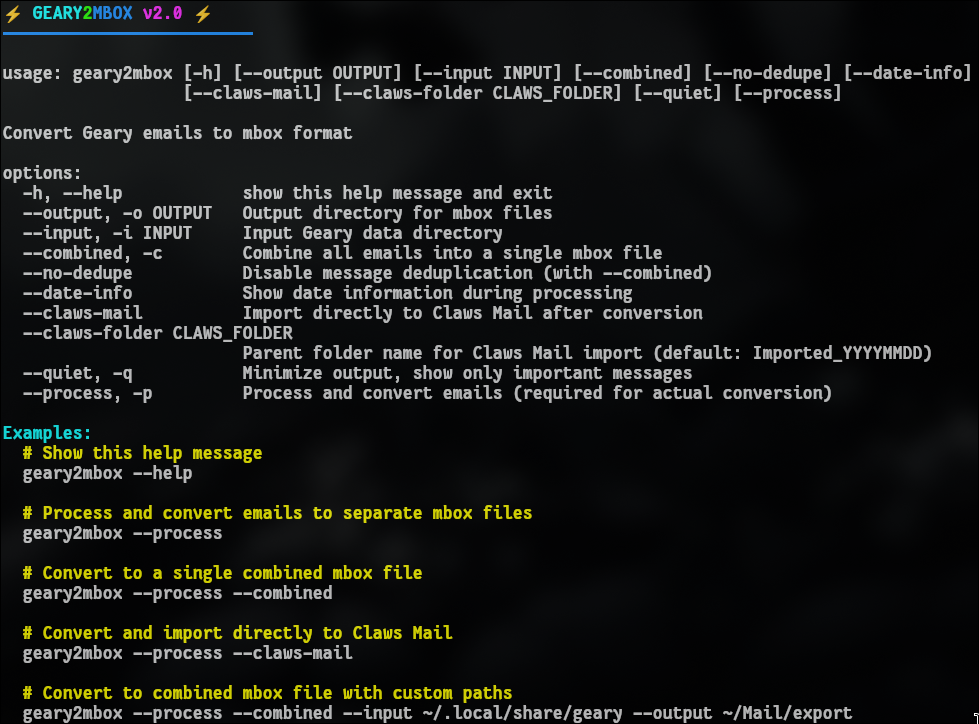

# Geary2Mbox

⚡ A colorful utility to convert Geary email databases to standard mbox format ⚡




## Overview

Geary2Mbox is a Python utility that extracts emails from Geary's SQLite database and converts them to standard mbox format. It provides a colorful, user-friendly interface with progress indicators and clear status messages.

## Features

- 📥 Extract emails from Geary's SQLite database
- 📁 Create individual mbox files for each folder
- 🔄 Create a single combined mbox file
- 📊 Show progress bars during conversion
- 🎭 Preserve email attachments
- 🧠 Smart duplicate detection for combined mode
- 🚀 Direct import to Claws Mail (optional)
- 🌈 Colorful, modern terminal interface

## Installation

1. Download the script:
   ```bash
   git clone https://github.com/huntercodes/geary2mbox.git
   cd geary2mbox
   ```

2. Make it executable:
   ```bash
   chmod +x geary2mbox
   ```

3. Optional: Install it to your PATH:
   ```bash
   sudo cp geary2mbox /usr/local/bin/
   # or
   cp geary2mbox ~/.local/bin/
   ```

## Requirements

- Python 3.6 or higher
- No external dependencies beyond the standard library!

## Usage

### Basic Usage

Show help:
```bash
geary2mbox
```

Convert emails to individual mbox files:
```bash
geary2mbox --process
```

### Advanced Options

Convert to a single combined mbox file:
```bash
geary2mbox --process --combined
```

Specify custom input and output directories:
```bash
geary2mbox --process --input ~/.local/share/geary --output ~/Mail/export
```

Import directly to Claws Mail:
```bash
geary2mbox --process --claws-mail
```

### All Options

```
usage: geary2mbox [-h] [--output OUTPUT] [--input INPUT] [--combined]
                  [--no-dedupe] [--date-info] [--claws-mail]
                  [--claws-folder CLAWS_FOLDER] [--quiet] [--process]

options:
  -h, --help            show this help message and exit
  --output, -o OUTPUT   Output directory for mbox files
  --input, -i INPUT     Input Geary data directory
  --combined, -c        Combine all emails into a single mbox file
  --no-dedupe           Disable message deduplication (with --combined)
  --date-info           Show date information during processing
  --claws-mail          Import directly to Claws Mail after conversion
  --claws-folder CLAWS_FOLDER
                        Parent folder name for Claws Mail import
  --quiet, -q           Minimize output, show only important messages
  --process, -p         Process and convert emails (required for conversion)
```

## Examples

### Basic Conversion
Convert emails to separate mbox files in the default location:

```bash
geary2mbox --process
```

This creates mbox files in `~/Documents/Mail/mbox/` (one for each folder).

### Combined File
Generate a single mbox file containing all emails:

```bash
geary2mbox --process --combined
```

This creates `all_mail.mbox` in the output directory.

### Custom Location
Specify a custom location for input/output:

```bash
geary2mbox --process --input ~/.local/share/geary --output ~/backups/mail
```

### Claws Mail Import
Convert and import directly to Claws Mail:

```bash
geary2mbox --process --claws-mail
```

## Why Use Geary2Mbox?

- **Easy migration** from Geary to other email clients
- **Backup your emails** in a standard format
- **No dependencies** beyond Python standard library
- **User-friendly interface** with progress indications
- **Handles attachments** properly

## How It Works

1. Connects to Geary's SQLite database
2. Extracts email content, headers, and attachments
3. Formats them according to mbox standard
4. Writes to individual mbox files or a combined file
5. Optionally imports directly to Claws Mail

## License

This project is licensed under the MIT License.

## Author

Created by Hunter Rose

## Contributing

Contributions are welcome! Please feel free to submit a Pull Request.
